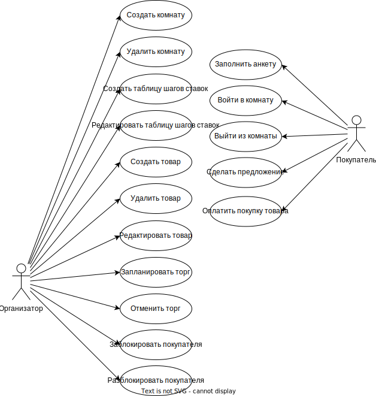

# Лабораторные работы по курсу «Проектирование программного обеспечения»

## Название проекта

Classic Auction Assistant

## Краткое описание идеи проекта

ПО для проведения торга классического английского открытого аукциона. Это ПО позволит уменьшить затраты на проведение торга и увеличить скорость исполнения аукционной сделки.

Покупатели подключаются по QR-коду к странице организатора аукциона. По выставлению товара начинается торг и пользователи выставляют свои предложения цены. Когда торг завершится, будет выписан чек на оплату и создан документ, подтверждающий проведение аукционной сделки.

## Краткое описание предметной области

Предметной областью проекта являются предложения о покупке.
Предложения создаются для отдельных товаров, выставленных организаторами.
Начальная цена и шаг ставки устанавливается организатором. Шаг ставки зависит от размера максимального предложения.

## Краткий анализ аналогичных решений по 3 критериям

Основные существующее решение: аукционист проводит торг совместно с ассистентами.

| Критерий                   | Проведение торга аукционистом | Предложенное решение |
| -------------------------- | ----------------------------- | -------------------- |
| Нагрузка на аукциониста    | -                             | +                    |
| Необходимость в помощниках | -                             | +                    |
| Скорость совершения сделки | -                             | +                    |

## Краткое обоснование целесообразности и актуальности проекта

Таким образом, из анализа аналогичных решений следует, что благодаря проведению аукциона с помощью программного ассистента проведения торгов будут улучшены эффективность, скорость и уменьшена затратность аукциона.

## Use-Case - диаграмма

## ER-диаграмма сущностей

## Архитектурные характеристики, важные для проекта

Проект представляет собой SPA.

1. Языки программирования:
   - [Golang](https://go.dev) - позволяет писать быстрый бекенд;
   - [TypeScript](https://www.typescriptlang.org) - единственный вариант написать фронтенд на курсе;
   - [GraphQL](https://graphql.org) - язык запросов для API.
2. Фреймворки:
   - [Gin](https://gin-gonic.com) - фреймворк для сервера;
   - [Svelte](https://svelte.dev/) - фреймворк для создания быстрых одностраничных приложений.
3. База данных: [PostgreSQL](https://www.postgresql.org/)
4. Контейниризация: [Docker](https://www.docker.com/)
